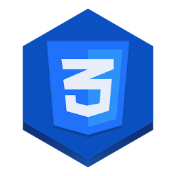
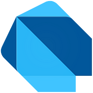

&nbsp;&nbsp;&nbsp;&nbsp;&nbsp;&nbsp;&nbsp;&nbsp;&nbsp;&nbsp;&nbsp;&nbsp;&nbsp;&nbsp;&nbsp;&nbsp;&nbsp;&nbsp;&nbsp;&nbsp;&nbsp;&nbsp;&nbsp;&nbsp;&nbsp;&nbsp;&nbsp;

# ❂ Valeico ❂

Hola chamito, soy Frank Cardenas, conocido como __Valeico__ en el mundo del desarrollo, la programación y del gaming.

Soy desarrollador web en el area de la contabilidad actualmente, pero he colaborado en varios proyectos de distintos rubros.

Al estar en mi perfil puedes libremente explorarlo y visualizar lo que gustes, siempre y cuando lo tenga visible 😉

Un consejito ya que estas por aqui :3
> _"Tener trabajo esta bien, hacerlo ya es avaricia"_ 😛

# ♚ Acerca de mi ♚
Formación profesional:
* _Ingeniero en Tecnologías de la Información y la Comunicación._ 🖥️
* _TSU. en Mercadotecnia y comercio electrónico._ 💻
* _Tec. en programación._ [ ]

Hobbies y gustos

* _Musico._ 🎸
* _Gamer._ 🎮
* _gatos, pinguinos, Machapes._ 🦝
* _y obvio la programación_ { }

# Tecnologias que domino ✨

## Actualmente cuento con conocimientos de las siguientes tecnologias

### Lenguajes:

<a style="text-decoration: none; " href="https://developer.mozilla.org/es/docs/Web/JavaScript">
<button 
    style="
        background-color: #4e4e4e; 
        color: white;
        border:1px;
        border-radius:5px;
        width:100px;
        height: 25px;
        cursor:pointer;">
         JavaScript
</button>
</a>
<a style="text-decoration: none; " href="https://htmlreference.io/">
<button 
    style="
        background-color: #e34c26;
        color: white; 
        border:1px solid black; 
        border-radius:5px;
        width:100px;
        height: 25px;
        cursor:pointer;">  HTML
</button>
</a>
<a style="text-decoration: none; " href="https://cssreference.io/"">
    <button 
        style="
            background-color: #264de4; 
            color: white;
            border:1px solid black; 
            border-radius:5px;
            width:100px;
            height:25px;
            cursor:pointer;"> CSS
    </button>
</a>
<a style="text-decoration: none; " href="https://www.php.net/manual/es/intro-whatis.php">
    <button 
        style="
            background-color: #8993be;
            color: white; 
            border:1px solid black; 
            border-radius:5px;
            width:100px;
            height:25px;
            cursor:pointer;"> PHP
    </button>
</a>

<a style="text-decoration: none;" href="https://esflutter.dev/docs/resources/bootstrap-into-dart">
<button 
    style="
        background-color: #075b9a;
        color: white;
        border:1px solid black; 
        border-radius:5px;
        width:100px;
        height:25px;
        cursor:pointer;"> Dart
</button>
</a>
<a style="text-decoration: none;" href="https://www.json.org/json-es.html">
<button 
    style="
        background-color: linen; 
        border:1px; 
        border-radius:5px;
        width:100px;
        height:25px;
        cursor: pointer;">Json
</button>
</a>

 

### Frameworks:

<a style="text-decoration: none;" href="https://vuejs.org/">
<button 
    style="
        background-color: #242424;
        color: white;
        border:1px; 
        border-radius:5px;
        width:100px;
        height:25px;
        cursor:pointer;"> Vue.js
</button>
</a>
<a style="text-decoration: none;" href="https://flutter.dev/">
<button 
    style="
        background-color: #1a68d3; 
        border:1px solid black; 
        border-radius:5px;
        width:100px;
        height:25px;
        cursor:pointer;">
</button>
</a>
<a style="text-decoration: none;" href="https://nodejs.org/es">
<button 
    style="
        background-color: #233056; 
        border:1px; 
        border-radius:5px;
        width:100px;
        height: 25px;
        cursor:pointer;">
</button>
</a>
<a style="text-decoration: none;" href="https://astro.build/">
<button 
    style="
        background: repeat,linear-gradient(83.21deg,#3245ff 0%,#bc52ee 100%); 
        border:1px solid black; 
        border-radius:5px;
        width:100px;
        height: 25px;
        cursor:pointer;">Astro
</button>
</a>

 

### CMS:

<a style="text-decoration: none;" href="https://wordpress.com/es/">
<button 
    style="
        background-color: white; 
        border:1px solid black; 
        border-radius:5px;
        width:100px;
        height: 25px;
        cursor:pointer;"> Wordpress
</button>
</a>
