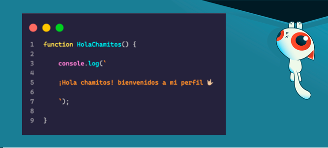

&nbsp;&nbsp;&nbsp;&nbsp;&nbsp;&nbsp;&nbsp;&nbsp;&nbsp;&nbsp;&nbsp;&nbsp;&nbsp;&nbsp;&nbsp;&nbsp;&nbsp;&nbsp;&nbsp;&nbsp;&nbsp;&nbsp;&nbsp;&nbsp;&nbsp;&nbsp;&nbsp;

# ❂ Valeico ❂

Hola chamito, soy Frank Cardenas, conocido como __Valeico__ en el mundo del desarrollo, la programación y del gaming.

Soy desarrollador web en el area de la contabilidad actualmente, pero he colaborado en varios proyectos de distintos rubros.

Al estar en mi perfil puedes libremente explorarlo y visualizar lo que gustes, siempre y cuando lo tenga visible 😉

Un consejito ya que estas por aqui :3
> _"Tener trabajo esta bien, hacerlo ya es avaricia"_ 😛

# ♚ Acerca de mi ♚
Formación profesional:
* _Ingeniero en Tecnologías de la Información y la Comunicación._ 🖥️
* _TSU. en Mercadotecnia y comercio electrónico._ 💻
* _Tec. en programación._ [ ]

Hobbies y gustos

* _Musico._ 🎸
* _Gamer._ 🎮
* _gatos, pinguinos, Machapes._ 🦝
* _y obvio la programación_ { }

# Tecnologias que domino ✨

## Actualmente cuento con conocimientos de las siguientes tecnologias

### Lenguajes:

### Frameworks:

 

### CMS:

